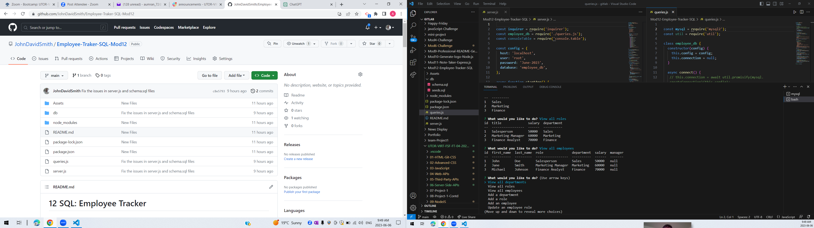

# 12 SQL: Employee Tracker

## Description 

* The main goal of this project is to create an application called Employee Tracker to manage a company's employee database.
* This application will use `Inquirer` package version 8.2.4., MySQL2 package and console.table.

## Contents 

* This Employee Tracker project content `package.json` with the required dependencies and data base files schema.sql and seeds.sql.  

## Installation 

* Doesn't need any instillation just run server.js in the command line by "npm start" then you have to choose what you would like to do.
  
## Usage 

* This application can be used by anyone wants to to manage a company's employee database.       

## Screenshot

## GitHub link

[The Employee Tracker](https://github.com/JohnDavidSmith/Employee-Traker-SQL-Mod12)

## Video link

https://drive.google.com/file/d/1q_4rZn7A44KAwMDr1ndLKqBQoWHdb9kb/view

## Credits
* 

## License
* 

## Badges
* 

## Features
* 

## How to Contribute
* 

## Test
*

